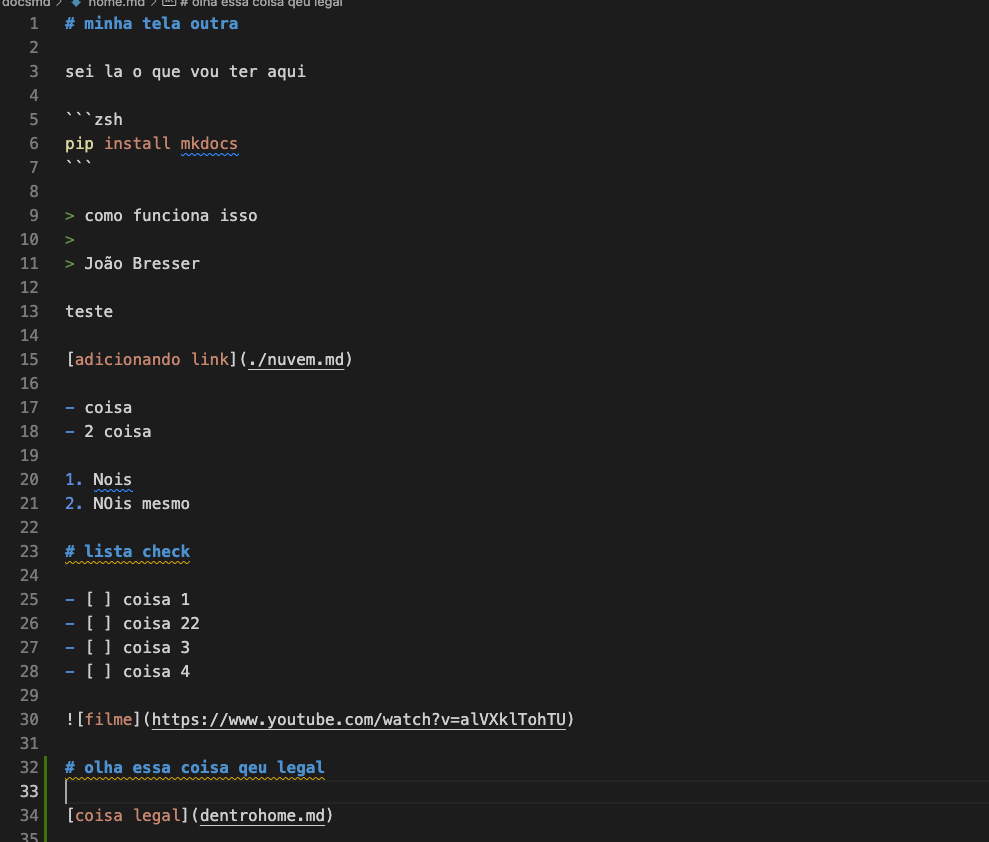

# minha tela outra

sei la o que vou ter aqui

```zsh
pip install mkdocs
```

> como funciona isso
>
> João Bresser

teste

[adicionando link](./nuvem.md)

- coisa
- 2 coisa

1. Nois
2. NOis mesmo

# lista check

- [ ] coisa 1
- [ ] coisa 22
- [ ] coisa 3
- [ ] coisa 4


# olha essa coisa qeu legal



# Documento com Imagens Redimensionadas

Aqui está uma imagem com tamanho padrão:


E aqui está a mesma imagem, mas redimensionada para 75% da largura:

[](dentrohome.md)

E outra imagem menor, com 25% da largura:


