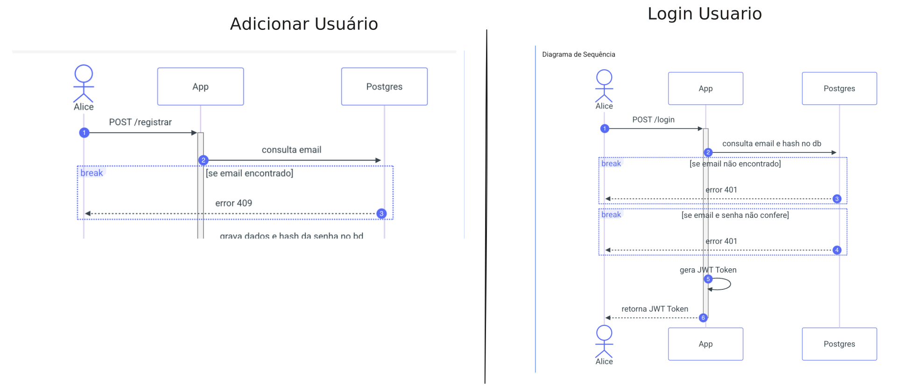
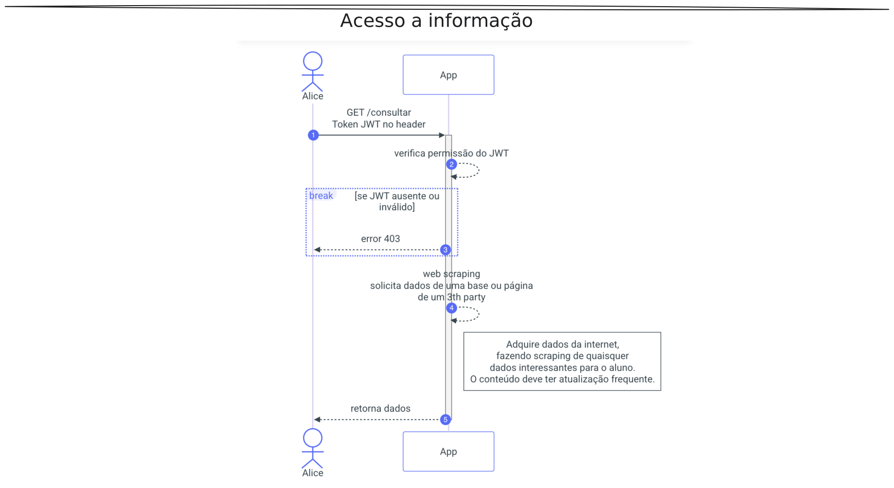
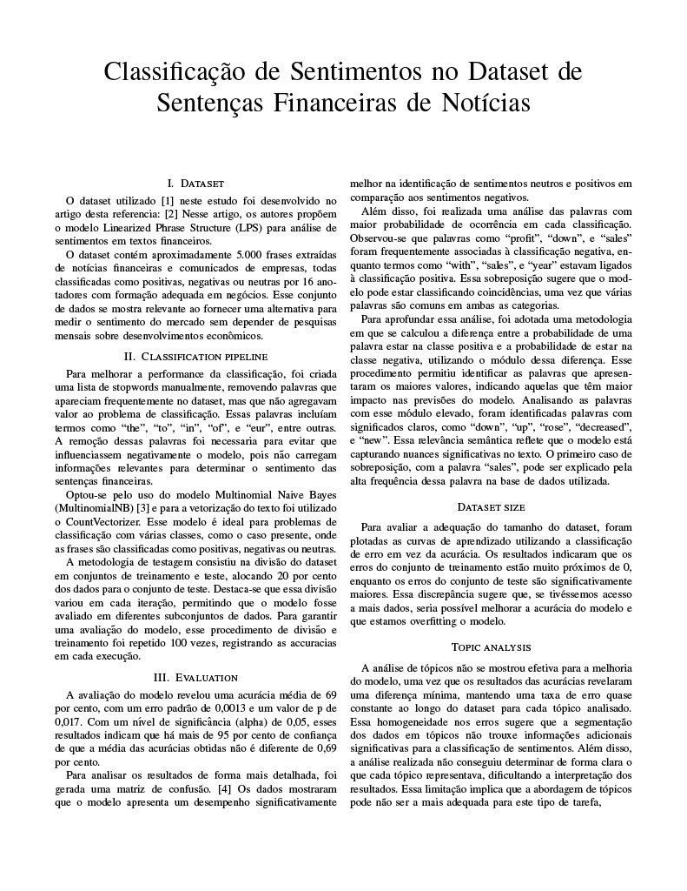

# 1. Controle de permições

[Git hub de acesso](https://github.com/Joao-kouznetz/Nuvem-Projeto1)




## Descrição

Esse projeto tem como objetivo elaborar uma API RESTfull capaz de cadastrar e autenticar usuários para fazer controle de acesso a informação. E dockernizar esse projeto para ser facilmente acessível.

### Tecnologias utilizadas

- FASTAPI (framework em python para desenvolvimento de APIs)
- SWAGGERUI (incluso no fastapi para desenvolvimento automático de documentação)
- PYDANTIC (método de tipagem para o python)
- JWT (método seguro para transmitir dados de maneira segura)
- SQLalchemy (ORM para conectar a base de dados)
- MYSQL (base de dados)
- Docker (método de conteinerização do aplicativo)
- MKDocs (maneira de fazer documentação utilizando markdown)

[Link de acesso para documentação](https://joao-kouznetz.github.io/Nuvem-Projeto1/)

# 2. Classificação de sentimentos em Noticias Financeiras

[Git hub acesso](https://github.com/Joao-kouznetz/Classificacao_sentimentos)



## Descrição

Este projeto tem como objetivo desenvolver um modelo de análise de sentimentos para textos financeiros, utilizando um conjunto de dados composto por aproximadamente 5.000 sentenças extraídas de notícias e comunicados empresariais. As frases foram classificadas por especialistas como positivas, negativas ou neutras, permitindo a construção de um modelo preditivo para identificar o tom das informações financeiras. O jupyter notebook pode ser encontrado no github

### Tecnologias utilizadas

- Python (linguagem principal para manipulação de dados e machine learning)
- Scikit-learn (biblioteca de machine learning utilizada para o modelo de classificação)
- Multinomial Naive Bayes (algoritmo escolhido para a classificação de sentimentos)
- CountVectorizer (técnica de vetorização de texto para transformação dos dados)
- Stopwords customizadas (removendo palavras irrelevantes para otimizar a precisão do modelo)
- Matriz de confusão (análise do desempenho do modelo)
- Curvas de aprendizado (avaliação da influência do tamanho do dataset no desempenho do modelo)

[pdf de classificação sentimentos](Classificacao_sentimentos.pdf)

# 3 Pokecrias

Jogo foi criado no 1 semestre da faculdade


```zsh
pip install mkdocs
```

## Descrição

O jogo Pokecrias é um jogo de luta inspirado nos jogos de pokemon de gameboy, porém, com os pré-candidatos a presidência de 2022 fazendo paródias quanto as suas pessoas, respectivamente. O mundo aberto foi criado mas não teve tempo o suficiente para adicionar conteúdo interessante.
